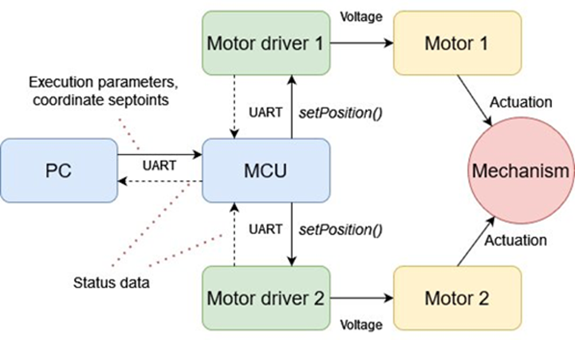
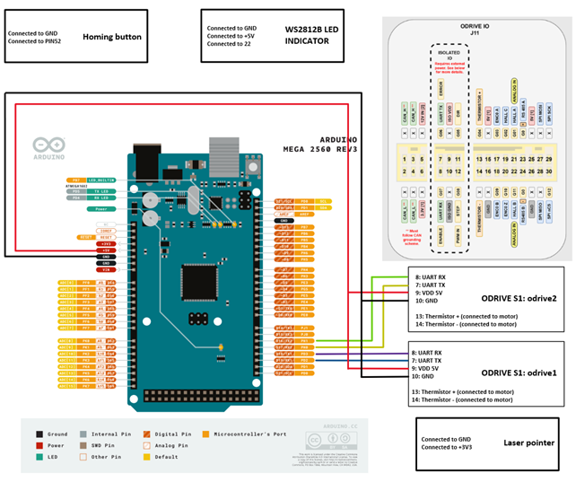
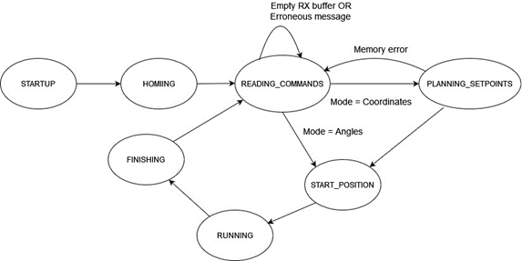
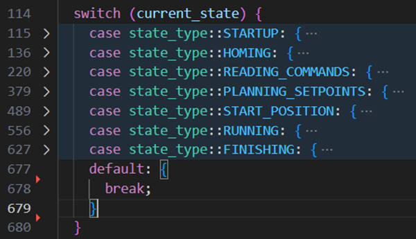
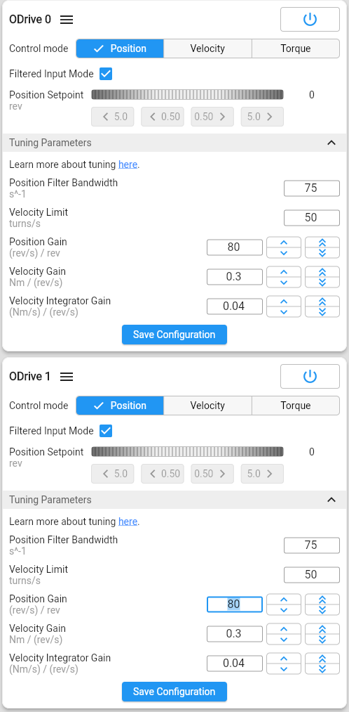

# 2-DOF Agile Eye

## Installation
VSCode with PlatformIO extension

Clone the repository and open as PlatformIO project. Choose the correct platform and build & upload the code. All library dependencies should download automatically. Current tested and operating development platform is Arduino Mega 2560. However manual fix is still needed. More details below.

__Manual fix:__
If you want to send more than a few setpoints, we recommend to change the RX buffer size from the default 64 bytes to 512. More than that might cause memory management issues due to low amount of RAM on the Arduino Mega's. 

This can be done by chaning line 53 in Arduino's __HardwareSerial.h__ library to __"#define SERIAL_RX_BUFFER_SIZE 512"__. This change couldn't be added to version control / project files, it has to be changed manually.

1. Open board.h
2. Go to Definition <Arduino.h> (right click)
3. Open Arduino.h
4. Go to Definition <HardwareSerial.h> (right click)
5. Change line 53 to: #define SERIAL_RX_BUFFER_SIZE 512

We recommend changing the Arduino Mega with some other equivalent and compatible board that has more RAM memory, such as teensy 4.1.

## Operation Guide
Use guide:
1. Open ShapeApp and open serial port communication
2. Insert homing tools when yellow light blinking
3. Confirm home position by pressing the button
4. Remove homing tools when blue light blinking
5. Confirm tools are removed by pressing the button
6. System is ready to receive commands

LED status guide:

    STARTUP: Red Blinking

    HOMING(Set Home Position): Yellow Blinking

    HOMING(Remove Homing Toools): Blue Blinking

    READING_COMMANDS & The Rest: Green Solid

## ODrive Set Up Guide
GUI configuration with default values

https://docs.odriverobotics.com/v/latest/guides/arduino-uart-guide.html#configuring-the-odrive

https://gui.odriverobotics.com/configuration

__NOTE!__

 UART Baudrate configuration doesn't work with the GUI

Use odrivetool to configure the baudrate (Same as Arduino, default = 115200)

__The most essential odrivetool commands to be set through Windows Shell:__

    odrv0.config.uart_a_baudrate = 115200

    odrv0.axis0.config.motor.current_soft_max = 10

    odrv0.axis0.config.motor.current_hard_max = 10

    odrv0.save_configuration()

(https://docs.odriverobotics.com/v/latest/guides/odrivetool-setup.html)

## Details
   &nbsp;   

   &nbsp;   

