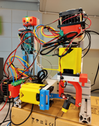
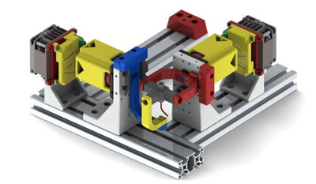
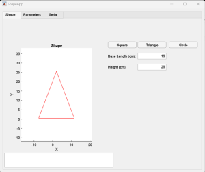

# 2-DOF Agile Eye

## Name
High-Speed 2D Actuator for Dynamic Orientation Control

Project Work Course 2024

Antti Chen

Alfred Backlund

Erkka Rantahalvari

## Description
Repository consists of source code for the system and a MATLAB UI. These can be found in the folders.

## Visuals
   &nbsp;      &nbsp;   

## Roadmap
No future releases.

## Project status
Project completion date 6.5.2024